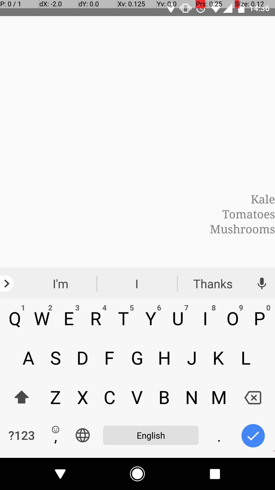
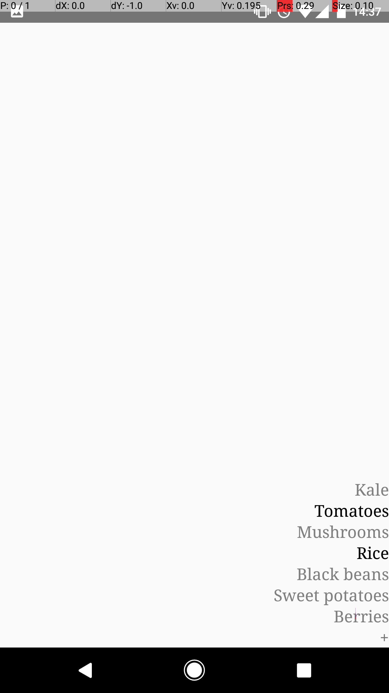
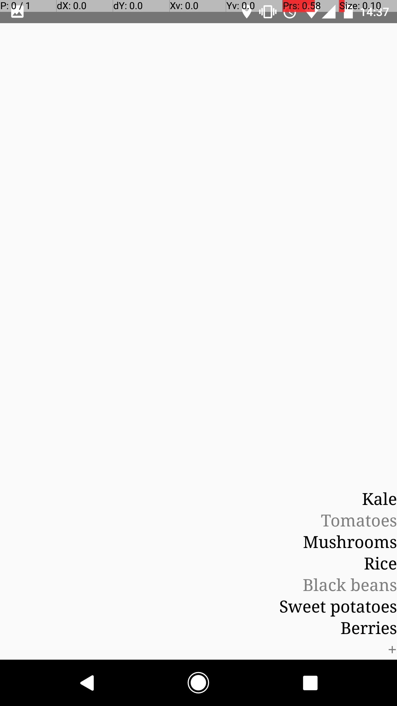

# Groceries

This is truly just an app you can use for anything where you only need one list.

_but_ it's going to be a part of a larger suite of technologies with a larger philosophy. This is only the first step...

### Screenshots:

Let's Add Something                                 |  Will Need Kale                                        |  Got Kale                                        |
:--------------------------------------------------:|:------------------------------------------------------:|:-------------------------------------------------:
    |    |  